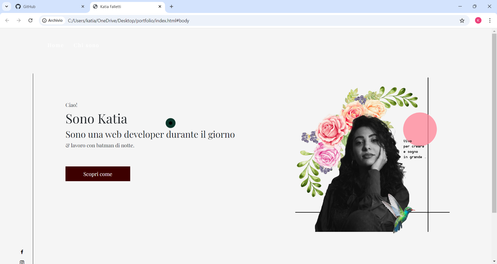
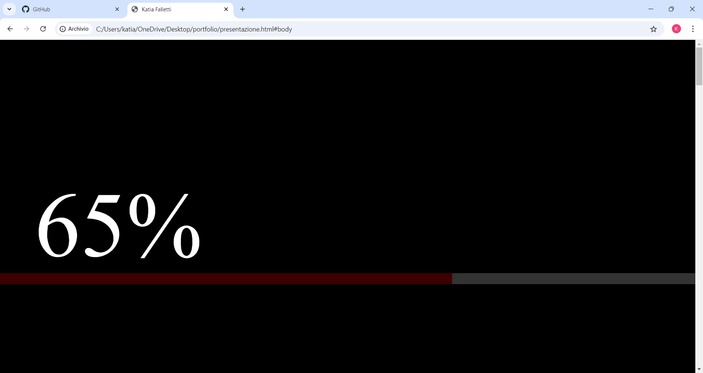
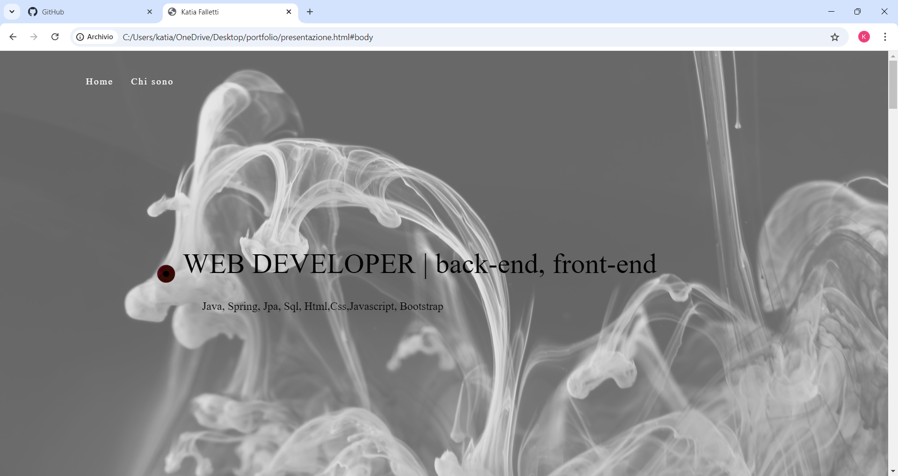
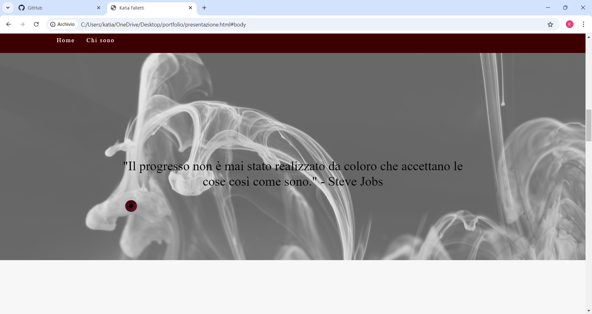
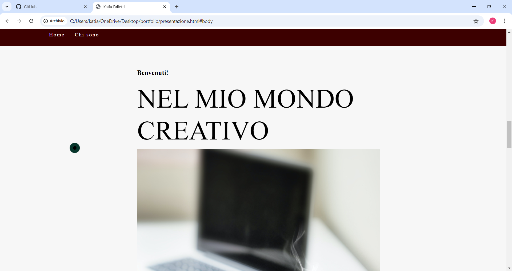
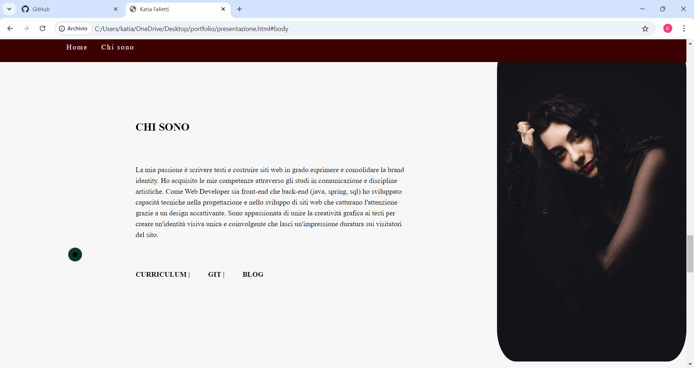
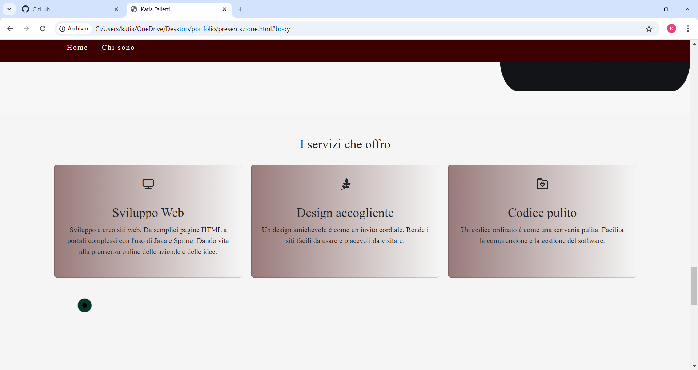
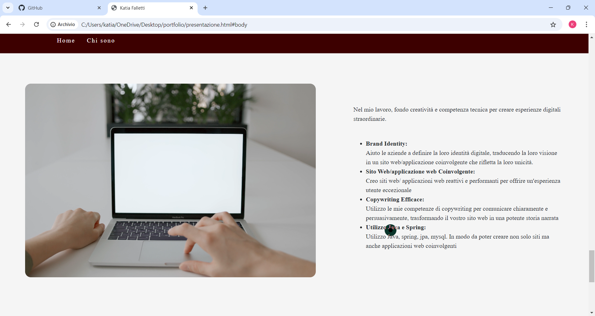
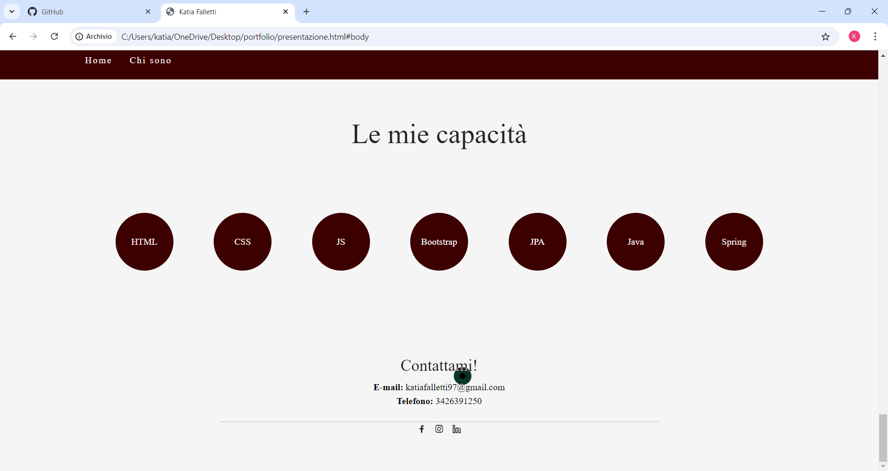

# Sito snowboard

Questo progetto tratta del mio porfolio personale

## Descrizione

Questo progetto è realizzato attraverso l'utilizzo di diverse tecnologie quali html css e javascript

## Funzionalità

La web app include le seguenti funzionalità:

- Home page interamente animata
- cursore animato e dinamico
- sito responsive per smartphone e tablet

## Tecnologie utilizzate

Il sito è stato sviluppato utilizzando le seguenti tecnologie:

- HTML
- CSS
- JavaScript

## Licenza

<!-- Questo progetto è stato rilasciato sotto la licenza MIT. Per ulteriori informazioni, leggere il file `LICENSE.md`. -->

## Crediti

Questo progetto è stato sviluppato da Katia Falletti.(https://it.linkedin.com/in/katia-falletti-616890225?trk=people-guest_people_search-card)
